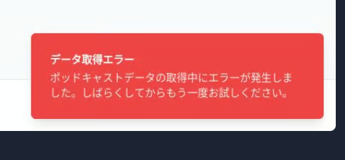

# Ossan.fm ショーノート検索

Ossan.fmポッドキャストのショーノート（参考リンク）を効率的に検索するためのウェブアプリケーションです。



## 目的

このプロジェクトは、以下の目的で開発されました：

- Ossan.fmポッドキャストのエピソードに含まれる参考リンク（ショーノート）を簡単に検索できるようにする
- リアルタイムな検索結果表示により、コンテンツ探索を効率化する
- 日本語に最適化されたインターフェースを提供する
- モバイルデバイスからも快適に利用できるレスポンシブデザインを実現する

## アーキテクチャ

このアプリケーションは、モダンなJavaScript/TypeScriptスタックを採用しています：

### フロントエンド
- **React**: UIコンポーネントの構築
- **TanStack Query**: データフェッチングとキャッシュ管理
- **Shadcn UI**: スタイリングとUIコンポーネント
- **Tailwind CSS**: ユーティリティファーストCSSフレームワーク

### バックエンド
- **Hono.js**: 高速で軽量なWebフレームワーク
- **Express.js**: Honoとの連携用アダプタ
- **Node.js**: サーバーサイドランタイム

### データストレージ
- **インメモリストレージ**: 高速なデータアクセスのための一時的なデータ保存

### その他
- **TypeScript**: 型安全な開発環境
- **Vite**: 高速な開発環境とビルドツール

## 利用ソフトウェア

### フレームワーク & ライブラリ
- React v18
- Hono.js
- Express.js
- TanStack Query v5
- Tailwind CSS
- Shadcn UI コンポーネント

### 開発ツール
- TypeScript
- Vite
- Node.js v20
- ESLint
- Drizzle ORM（型定義用）

## ビルド方法

### 前提条件
- Node.js v18以上
- npm v7以上

### インストール手順

1. リポジトリをクローン
```bash
git clone https://github.com/tamanishi/replit_trial_ossanfm_search.git
cd replit_trial_ossanfm_search
```

2. 依存パッケージのインストール
```bash
npm install
```

3. 開発サーバーの起動
```bash
npm run dev
```

4. 本番用ビルド
```bash
npm run build
```

## テスト方法

現在、自動テストは実装されていません。手動でのテストは以下の手順で行ってください：

1. 開発サーバーを起動
```bash
npm run dev
```

2. ブラウザで`http://localhost:5000`にアクセス

3. 検索ボックスに検索したい語句（例: 「はてな」）を入力し、リアルタイムに結果が表示されることを確認

## デプロイ方法

### Replit でのデプロイ

1. Replitダッシュボードから「Deploy」ボタンをクリック
2. デプロイ設定を確認して「Deploy」を選択
3. デプロイ完了後、公開URLが発行されます

### サーバーへのデプロイ

1. 本番用ビルドを作成
```bash
npm run build
```

2. 生成された`dist`ディレクトリの内容をサーバーに転送

3. サーバーでアプリケーションを起動
```bash
npm run start
```

## ライセンス

このプロジェクトはMITライセンスの下で公開されています。詳細は[LICENSE](LICENSE)ファイルを参照してください。

## 謝辞

- [Ossan.fm](https://ossan.fm): 素晴らしいポッドキャストコンテンツの提供
- このプロジェクトは学習および個人的な目的で作成されたものであり、Ossan.fmの公式プロジェクトではありません